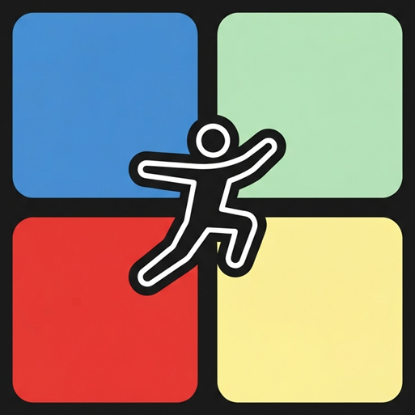
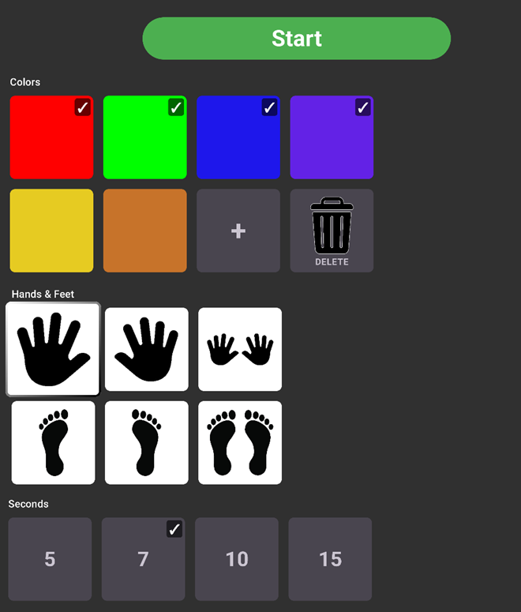
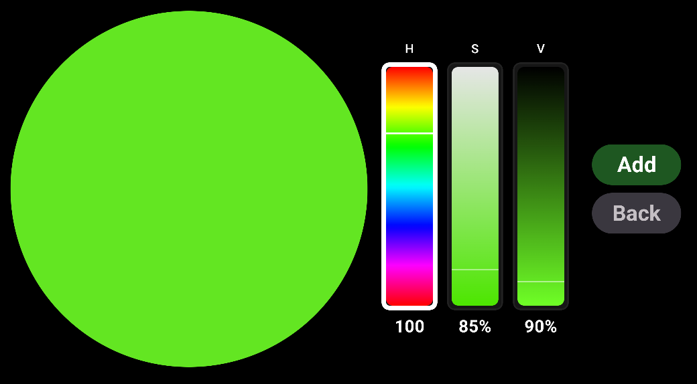
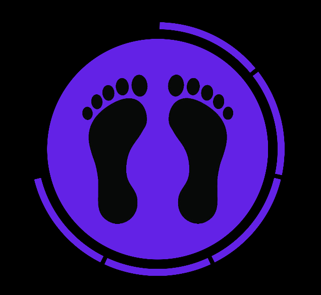

# ColorZone

A physical movement game for **Android TV**, inspired by the YouTube series
[*Tapete do Movimento*](https://www.youtube.com/results?search_query=tapete+do+movimento).
Players place coloured mats on the floor and follow on-screen prompts that tell them
which colour to touch and which hand or foot to use.

Built with **Kotlin** and **Jetpack Compose for TV** (tv-material3).

The core feature of the game is just to show a colored circle, potentially with a hand or foot icon inside it, on the tv for a short amount of time, before randomly changing the color and icon.

## Alternative games
- Colored cones in the living room, run to the cone that matches the color on the tv.
- Pick up lego blocks matching the color on the tv.
- More ideas may come

---

## How It Works

### 1. Settings Screen

Configure the game before starting. Everything is laid out in a scrollable grid
optimised for D-pad / remote navigation.



- **Colour tiles** — Tap to select/deselect colours for the next game.
- **"+" tile** — Opens the colour picker to add a custom colour (HSV).
- **Delete tile** — Toggles delete mode. While active, tapping a colour removes it.
- **Hands & feet** — Choose which body-part prompts appear.
- **Duration** — Seconds per prompt (5, 7, 10, or 15).
- **Start** — Launches the game. Disabled until at least one colour is selected.

### 2. Colour Picker

A full-screen HSV colour picker. Adjust hue, saturation, and value with the
remote, then confirm to add the colour to your palette. Colours are persisted
to local storage.



### 3. Game Screen

A coloured circle fills the screen with a body-part icon inside it. A segmented
countdown ring surrounds the circle — segments disappear as time runs out.
When the timer hits zero, a new random colour + icon combination appears.



Press **Back** on the remote to exit to the settings screen at any time.

---

## Pre-built APK

A ready-to-install debug APK is available at:

```
Release/ColorZoneApp.apk
```

Sideload it to your Android TV device with a usb stick. Just insert the stick, click the apk file to install. You may need to enable developer options on the tv, and allow installation from unknown sources.

---

## Technical Details

| Detail              | Value                                       |
|---------------------|---------------------------------------------|
| Language            | Kotlin                                      |
| UI framework        | Jetpack Compose for TV (tv-material3)       |
| Min SDK             | 26 (Android 8.0)                            |
| Target SDK          | 36                                          |
| Compile SDK         | 36                                          |
| Java compatibility  | 11                                          |
| Application ID      | `pastimegames.colorzone`                    |
| Build system        | Gradle (Kotlin DSL)                         |

---

## Building from Source

1. Open the project in Android Studio (Ladybug or later recommended).
2. Sync Gradle.
3. Select an Android TV emulator or connected device.
4. Run the `app` configuration.

---

## Project Structure

```
app/src/main/java/pastimegames/colorzone/
├── MainActivity.kt                  # Entry point, screen navigation
├── game/
│   ├── GameConfig.kt                # Config passed from settings to game
│   ├── GameRandomizer.kt            # Random colour/icon selection logic
│   ├── GameScreen.kt                # Game UI with circle + countdown
│   ├── GameState.kt                 # Mutable game state
│   └── components/
│       ├── ColoredCircle.kt         # Coloured circle with icon overlay
│       └── CountdownRing.kt         # Segmented countdown ring
├── settings/
│   ├── SettingsScreen.kt            # Settings UI (colour grid, icons, etc.)
│   ├── SettingsUiState.kt           # Immutable state + toggle/add/delete
│   ├── SettingsDefaults.kt          # Default settings on first launch
│   ├── colorpicker/
│   │   ├── ColorPickerScreen.kt     # HSV colour picker screen
│   │   └── components/
│   │       └── HsvBar.kt            # HSV slider bar component
│   ├── components/
│   │   ├── SelectableSquare.kt      # Reusable focusable tile
│   │   ├── SettingsGridRow.kt       # Grid row layout
│   │   └── StartGameButton.kt       # Start game button
│   ├── data/
│   │   └── ColorPaletteStore.kt     # Local persistence for colour palette
│   └── model/
│       ├── BodyIcon.kt              # Hand/foot icon enum
│       ├── DurationSeconds.kt       # Timer duration enum (5/7/10/15s)
│       └── GameColor.kt             # Colour model
└── ui/theme/
    ├── Color.kt
    ├── Theme.kt
    └── Type.kt
```
